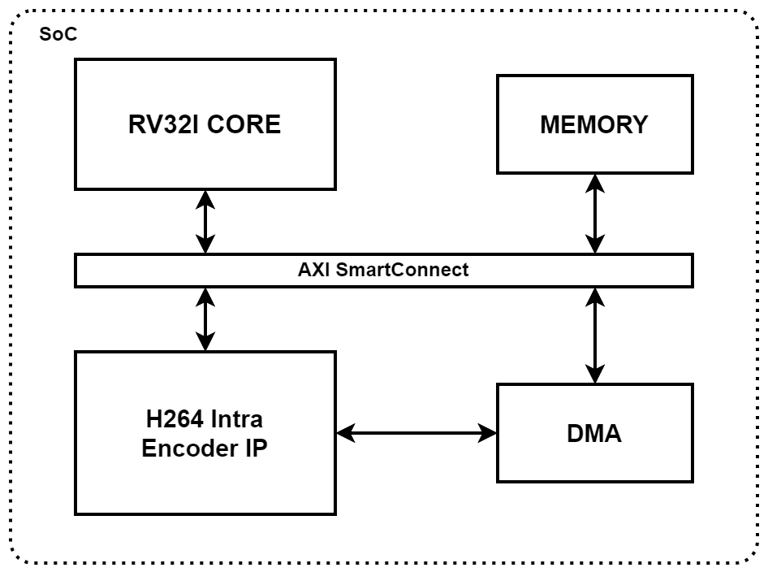
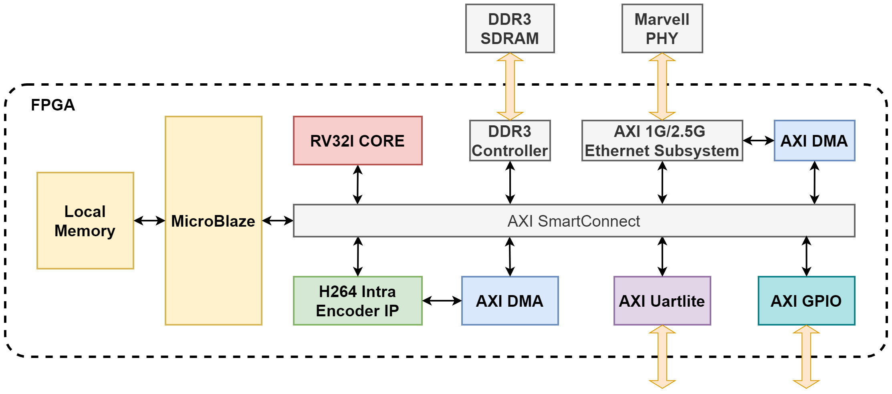

# DESIGN OF A RISC-V 32-BIT PROCESSOR-BASED SOC WITH H.264 INTRA-FRAME ENCODING ON FPGA

## Project Summary
This thesis presents the design and implementation of a System-on-Chip (SoC) that integrates a custom 32-bit RISC-V RV32I processor with an H.264/AVC intra-frame video encoder on the Xilinx Virtex-7 VC707 FPGA.

The goal is to develop a fully RISC-V-controlled system capable of real-time video compression, demonstrating the feasibility of applying open-source RISC-V architecture in embedded applications with high data processing demands.

## System Overview

  

### RISC-V RV32I CPU (5-stage pipeline)
- Supports all 37 base instructions
- AXI-Lite interface for memory-mapped peripheral access (AXI-Lite protocol verified using AXI VIP)
- Operates stably at 100 MHz
- Implemented on Xilinx Virtex-7 VC707

### H.264 Intra-frame Encoder IP (open-source based)
- Integrated into the SoC with AXI-Lite (control) and AXI-Stream (data) interfaces
- Uses asynchronous FIFOs for clock domain crossing (CDC)
- CDC resolved via 2FF synchronizers and FIFO buffers
- Operates at 62.5 MHz
- Functionally verified via simulation in Vivado
- Capable of encoding FHD @ 30 FPS with a 10.19% compression ratio at QP=28

### Memory (simulation only)
- DDR SDRAM emulator block for testbench use
- AXI-Full slave interface (based on Xilinx protocol template)
- Loads raw `.yuv` video files for simulation
- Receive bitstream data from H.264 Encoder IP via AXI DMA.
  
### AXI DMA (Xilinx)
- Configured in direct register mode
- MM2S and S2MM control/status/length registers setup for data flow

## Project Structure
- `/rtl/`         – RISC-V CPU, H.264 encoder IP, and SoC modules
- `/matlab/`      - description of the operating pricible of H.264 video codec (encode + decode)
- `/sim/`         – Testbenches and simulation files  
- `/sw_scripts/`  – Python scripts for `.yuv` extraction and Ethernet data transfer  
- `/image/`       – Images and diagrams for documentation  
- `/docs/`        - Report files & reference papers
## Implement SoC on FPGA Virtex-7 (on-going)

## Authors & Supervisor
- **Authors**: Dao Phuoc Tai, Nguyen Anh Khoi 
- **Supervisor**: Mr. Ngo Hieu Truong – Faculty of Computer Engineering, UIT – VNU-HCM  
- **Academic Year**: 2025
