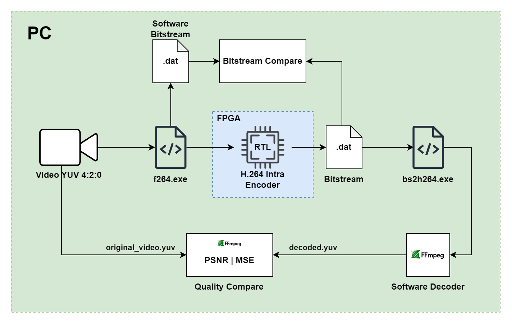

# DESIGN OF A RISC-V 32-BIT PROCESSOR-BASED SOC WITH H.264 INTRA-FRAME ENCODING ON FPGA

## Project Summary
This thesis presents the design and implementation of a System-on-Chip (SoC) that integrates a custom 32-bit RISC-V RV32I processor with an H.264/AVC intra-frame video encoder on the Xilinx Virtex-7 VC707 FPGA.

The goal is to develop a fully RISC-V-controlled system capable of real-time video compression, demonstrating the feasibility of applying open-source RISC-V architecture in embedded applications with high data processing demands.

## Project Structure
- `/rtl/`         – RISC-V CPU, H.264 encoder IP, and SoC modules
- `/matlab/`      - description of the operating pricible of H.264 video codec
- `/sim/`         – Testbenches and simulation files  
- `/sw_scripts/`  – Python scripts for `.yuv` extraction and Ethernet data transfer  
- `/image/`       – Images and diagrams for documentation  
- `/docs/`        - Report files & reference papers
  
## System Overview

  

### RISC-V RV32I CPU (5-stage pipeline)
- Supports all 37 base instructions
- AXI-Lite interface for memory-mapped peripheral access (AXI-Lite protocol verified using AXI VIP)
- Operates stably at 100 MHz
- Implemented on Xilinx Virtex-7 VC707

### H.264 Intra-frame Encoder IP (open-source based)
- Integrated into the SoC with AXI-Lite (control) and AXI-Stream (data) interfaces
- Uses asynchronous FIFOs for clock domain crossing (CDC)
- CDC resolved via 2FF synchronizers and FIFO buffers
- Operates at 62.5 MHz
- Functionally verified via simulation in Vivado
- Capable of encoding FHD @ 30 FPS with a 10.19% compression ratio at QP=28

### Memory (simulation only)
- DDR SDRAM emulator block for testbench use
- AXI-Full slave interface (based on Xilinx protocol template)
- Loads raw `.yuv` video files for simulation
- Receive bitstream data from H.264 Encoder IP via AXI DMA.

### AXI DMA (Xilinx)
- Configured in direct register mode
- MM2S and S2MM control/status/length registers setup for data flow
  
## Test senarios
### 1. RV32I CPU
#### 1.1. 37 instruction test (implemented on Virtex-7 FPGA)
The instruction testing process covers all 37 base instruction defined in the RV32I specification:
- R-type: add, sub, xor, or, and, sll, srl, sra, slt, sltu
- I-type (imm): addi, xori, ori, andi, slli, srli, srai, slti, sltiu
- I-type (load): lb, lh, lw, lbu, lhu
- S-type:  sb, sh, sw
- B-type: beq, bne, blt, bge, bltu, bgeu
- Jump and Upper Immediate Instructions: jal, jalr, lui, auipc

#### 1.2. Peripheral access via MMIO Interface (used AXI-Lite Protocol)
This test verifies the CPU's ability to access peripheral registers mapped outside the internal DMEM address space. It validates the generation of correct AXI-Lite transactions triggered by load (lw, lh, lb) and store (sw, sh, sb) instructions.

### 2. H.264 Encoder IP
For YUV 4:2:0 input, a custom Python tool is used to parse frames into 16×16 macroblocks compatible with the encoder input format.  
The processed raw data is then loaded into either:
- A simulated 1 GB DDR RAM block (for simulation), or  
- The physical 1 GB DDR SDRAM via Ethernet (on FPGA)

After loading, the encoder is triggered to start compression. Encoded output is verified against a reference software encoder and converted to `.264` format. Finally, the decoded video is compared to the original raw input using **PSNR**, measured via `ffmpeg`.

  

### 3. SoC: Encoder Flow Control
The overall control sequence is as follow:
1. Initialize and configure the system
2. Set up the AXI DMA (source/destination addresses & transfer size)
3. Configure and start the H.264 encoder
4. Run the main program according to the given settings
5. Exit the program

  

## Implement SoC on FPGA Virtex-7 (on-going)
On the physical FPGA, input video must reside in the on‑board 1 GB DDR SDRAM (the on‑chip BRAM is too small). To stream the data from the host PC to DDR, the design adds a Xilinx **AXI 1G/2.5G Ethernet Subsystem**. Configuration is handled by a **MicroBlaze** soft‑core running in Vitis, using **lwIP** and helper libraries to receive Ethernet frames. A small Python script on the PC builds and sends RAW Ethernet packets (via `socket`) to feed the FPGA.

  

## Authors & Supervisor
- **Authors**: Dao Phuoc Tai, Nguyen Anh Khoi 
- **Supervisor**: Mr. Ngo Hieu Truong – Faculty of Computer Engineering, UIT – VNU-HCM  
- **Academic Year**: 2025
